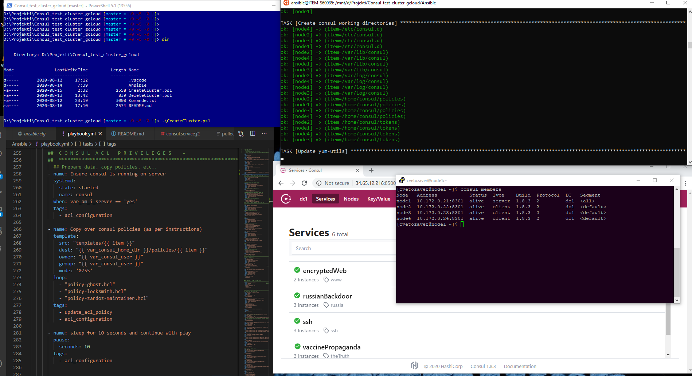

# Test consul cluster of 4 nodes

Powershell and Ansible script for deploying a Consul cluster of 4 nodes. 

Powershell script creates a new project and creates 4 new Virtual Machines on GoogleCloud, opens communication ports on the internal network and http/https ports on public network.

Ansible deploys and provisions the  VMs.
## DEMO
DEMO: [2020 08 16] https://34.65.14.153:8501/ 
* Bootstrap token: `ff19ff9d-8deb-f56d-83e8-d1fa1700c4c4`
* Ghost token:    `ddd0fc52-3b21-8afb-839b-d32bf2d4990d`
* Agent token:   `e73bcefc-ddc4-0e4f-47e3-98050b934306`


## Prerequisities
- A gcloud account with enabled billing and enaled APIs
- Powershell [5.1]
- CloudShell
- CloudTools for Powershell
- Ansible [2.9]

## Installation

1.  Configure CloudTools for Powershell with your Google Cloud credentials.

2.  Run PowerShell script **CreateCluster.ps1**.

3.  Note the **EXTERNAL**/public IPs allocated to you and add them manually to the Ansible hosts file located in ./Ansible/hosts.yml. It should look something like this:

From powershell:
```bash
                                                                          
NAME         ZONE            MACHINE_TYPE   PREEMPTIBLE  INTERNAL_IP  EXTERNAL_IP    STATUS
node1        europe-west6-c  n1-standard-1               10.172.0.21  34.65.12.216   RUNNING
node2        europe-west6-c  n1-standard-1               10.172.0.22  34.65.11.45    RUNNING
node3        europe-west6-c  n1-standard-1               10.172.0.23  34.65.185.100  RUNNING
node4        europe-west6-c  n1-standard-1               10.172.0.24  34.65.14.153   RUNNING
/>_
```

copy to Ansible/hosts.yml
```bash
---
all:
  ## ALL HOSTS THAT EXIST   
  hosts:                           # IP ADDRESSES        # DESCRIPTION   
    node1:
      ansible_host:               34.65.12.216
    node2:
      ansible_host:               34.65.11.45
    node3:
      ansible_host:               34.65.185.100
    node4:
      ansible_host:               34.65.14.153
```

4. Optional

- Replace PKI files in **Ansible/certs** directory. Keep naming, keep datacenter name as 'dc1'.
```bash
- consul-agent-ca.pem
- dc1-node1.pem
- dc1-node1-key.pem
```

- Modify **{{ var_consul_secret }}** variable in the **Ansible/playbook.yml** file. 
It carries the AES key for encrypting internal consul communication. 
```bash
var_consul_secret: "+BBkVKsPndMntq5LWrRShLmQJIVV14m+c1iotmN/6GQ=" 
```
```bash
[root@node4 ~]# consul keygen
ewl24qUh0qcNUCiQz8JuoiljDBVGZGwYqTHLNTXnO6k=
```


5.  Play the Ansible playbook.

6.  Wait a minute.

7.  Navigate to https://**node1-external-IP**:8501. You should get the welcome screen.

8.  SSH to  node-1 machine and get the **bootstrap management token**

```bash
/home/consul/tokens/
```


## Additional configuration

- ACL privileges are set to allow by default. Verify if servers are up and running, then gradually start adding agent token to each one and setting `agent_policy`to `deny`, making sure there are no errors in the logs.  (Tried with automation, received all sorts of errors).

To do this, edit the configuration file in `/etc/consul.d/99consul.json`. It should look like this on thw server (with the `agent` key edited)
```
    "acl": {
        "enabled": true,
        "default_policy": "deny",
        "enable_token_persistence": true,
        "tokens": {
            "agent": "00000000-0000-0000-0000-000000000000 }}"
        }
```

and like this on the clients (agent token does not have to be defined on the clients).
```
    "acl": {
        "enabled": true,
        "default_policy": "deny",
        "enable_token_persistence": true
```

- TLS configuration is set, but not set to verify clients. In order to only have access to the UI with a certificate, set
verify_incoming **on the server node** to true and install key to the browser in order to access it. It should look like this:

```
     "verify_incoming": true, 
     "verify_outgoing": true,
     "verify_server_hostname": true, 

```


- From here on, Consul cluster is ready to be provisioned on the web interface using API keys. 

## ANSIBLE AD-HOC COMMANDS
Use Ansible AD-HOC commands to send the same shell command to all servers. [Replace cvetozaver with you actual google cloud username that has sudo rights]

- See if consul is running on the all nodes
    `ansible consul_cluster -i hosts.yml -m shell -a "systemctl status consul" -u cvetozaver --become`

- See if allow_tls is enabled on the server configuration file
    `ansible node1 -i hosts.yml -m shell -a "cat /etc/consul.d/99config.json | grep -iF allow_tls"-u cvetozaver --become`

- See what tokens we have saved in the home dir
    `ansible node1 -i hosts.yml -m shell -a "cat /home/consul/tokens/agent-token" -u cvetozaver --become`

- Cat the whole configuration file from the whole cluster
    `ansible consul_cluster -i hosts.yml -m shell -a "cat /etc/consul.d/99config.json | grep -iF verify_incoming-u cvetozaver --become`

- Use any other shell command. JSON files can be edite with JQ or  . If you have more than one configuration to fix, maybe write the Ansible playbook


## Default directories
- bootstrap management token and some test tokens are saved on node1: 
/home/consul/tokens

- Log files:
/var/log/consul/*

- Certificates and keys are in the default CentOS directory for keys and certs
/etc/pki/tls/certs/

## Issues
- Enabling ACL on all servers locked down the nodes, no tokens were valid. Debugging this was N O T  E A S Y . Make sure to do it gradually, starting with the server.

- Custom services seem to be discovered no problem. The actual consul service however...

- When you Log in (or logout) to the web protal, refresh the website. If you don't do that, the website will tell you you are loged in but you will not see the services the token allows you to see. 

## Screenshot


## License
[MIT]
